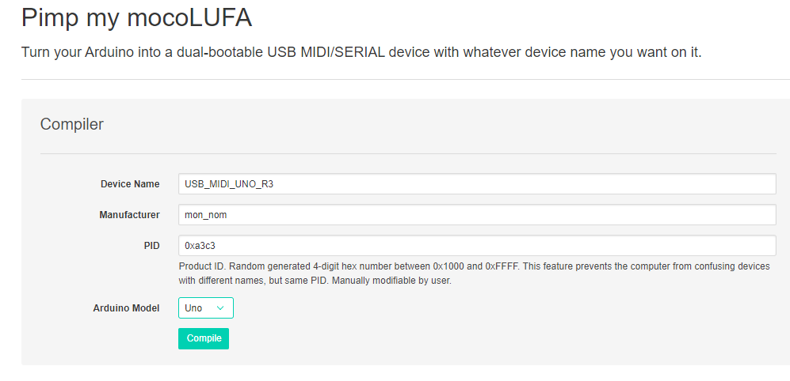

 
# ARDUINO EN USB MIDI

- [ARDUINO EN USB MIDI](#arduino-en-usb-midi)
  - [Arduino en USB Midi](#a-en-usb-midi)
  - [Arduino en USB Série](#a-en-usb-serie)
  - [Générer usb_midi_uno_r3.hex](#generer-hex)
  - [Sites Web](#sites)
  - [Programmer le µc 16U2 avec FLIP (pas testé)](#flip)


## Arduino en USB Midi<a id="a-en-usb-midi"></a>

Décompresser dfu-programmer-win-0.7.2.7z et aller dans ce dossier

Déconnecter, enlever tous les fils de montage (Arduino à nu) et connecter l'arduino et faire ce court circuit :


puis

```
> .\dfu-programmer.exe  atmega16u2 erase
Checking memory from 0x0 to 0x2FFF...  Not blank at 0x1.
Erasing flash...  Success
> .\dfu-programmer.exe atmega16u2 flash .\usb_midi_uno_r3.hex
Checking memory from 0x0 to 0x14FF...  Empty.
0%                            100%  Programming 0x1500 bytes...
[>>>>>>>>>>>>>>>>>>>>>>>>>>>>>>>>]  Success
0%                            100%  Reading 0x3000 bytes...
[>>>>>>>>>>>>>>>>>>>>>>>>>>>>>>>>]  Success
Validating...  Success
0x1500 bytes written into 0x3000 bytes memory (43.75%).
> .\dfu-programmer.exe atmega16u2 reset
```

Déconnecter l'Arduino Uno 

Re-connecter pour voir 

 

& 


Pour remettre un nouveau sketch (programme) alors le passer en Port "USB-Série" il faut : déconnecter l'Arduino,  faire un court circuit permanent

 

et enfin re-brancher l'Ardino au port USB de l'ordinateur, ouvrir le gestionnaire de périphériques Windows pour voir COM3 (ou un autre COM*)


***

## Arduino en USB Série <a id="a-en-usb-serie"></a>
Le même que précédemment sauf que usb_midi_uno_r3.hex est remplacé par usb_midi_uno_r3.hex

***

## Générer usb_midi_uno_r3.hex<a id="generer-hex"></a>

https://moco-lufa-web-client.herokuapp.com/#/ 



***

## Sites Web <a id="sites"></a>

[Updating the Atmega8U2 and 16U2 on an Uno or Mega2560 Using DFU](https://docs.arduino.cc/hacking/software/DFUProgramming8U2)

[MIDI over USB](https://dartmobo.com/midi-over-usb/)

[#3 Traktorino how to: Make the Arduino a MIDI Class-Compliant Device](https://www.youtube.com/watch?v=18OKo9sQ_s0)


## <a id="flip">Programmer le µc 16U2 avec FLIP (pas testé)</a>
jre for all platform
https://www.java.com/fr/download/manual.jsp
sinon bug jre non trouvé

https://microchipsupport.force.com/s/article/Flip-software-for-Windows-10-64-bit

https://www.arduino.cc/en/Hacking/DFUProgramming8U2
dfu-programmer
https://dfu-programmer.github.io/


