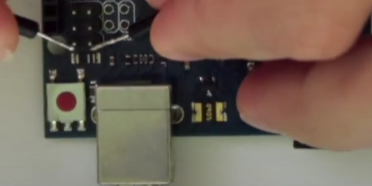

# Tout d'abord
* le fichier arduino uno rev 3 .hex pour le midi est dans https://github.com/kuwatay/mocolufa/tree/master/HEX/dualMoco.hex
* le fichier arduino uno rev 3 .hex pour la com série (original) est ici https://github.com/arduino/ArduinoCore-avr/blob/master/firmwares/atmegaxxu2/arduino-usbserial/Arduino-usbserial-atmega16u2-Uno-Rev3.hex (c'est ce qui est dit dans le README.txt et aussi ici https://support.arduino.cc/hc/en-us/articles/4408887452434-Flash-USB-to-serial-firmware-in-DFU-mode)

# Table des matières

- [Arduino en USB Midi](#a-en-usb-midi)
  - [Mettre un sketch (un programme)](#sketch)
- [Arduino en USB Série](#a-en-usb-serie)


## Arduino en USB Midi (images de Windows) <a id="a-en-usb-midi"></a>

* Décompresser dfu-programmer-win-0.7.2.7z et aller dans ce dossier
* Déconnecter
* Enlever tous les fils de montage (Arduino à nu)
* Connecter l'arduino et faire ce court-circuit :



puis pour Windows

```
> .\dfu-programmer.exe  atmega16u2 erase
> .\dfu-programmer.exe atmega16u2 flash .\dualMoco.hex
> .\dfu-programmer.exe atmega16u2 reset
```

pour Linux

```
cd ~/Téléchargements/mocolufa-master/HEX
dfu-programmer atmega16u2 erase
dfu-programmer atmega16u2 flash dualMoco.hex
dfu-programmer atmega16u2 reset
```

* Déconnecter l'Arduino Uno
* Re-connecter pour voir\
\
et\


Avec Linux on verra ce port Midi avec :
```
$ aplaymidi -l
 Port    Client name                      Port name
 32:0    MocoLUFA                         MocoLUFA MIDI 1
```

## Mettre un nouveau programme (en configuration MIDI)<a id="sketch"></a>
Pour remettre un nouveau sketch (programme) alors le passer en Port "USB-Série" il faut :
* déconnecter l'Arduino
* faire un court-circuit permanent\
\
* Re-brancher l'Ardino au port USB de l'ordinateur
* ouvrir le gestionnaire de périphériques Windows pour voir COM3 (ou un autre COM*)\


***

## Arduino en USB Série <a id="a-en-usb-serie"></a>
Le même que précédemment sauf que "version_midi.hex" est remplacé par "version_série_d_origine.hex".\
Il redeviendra en série (comme à l'origine).

Avec Linux on verra ce port serie :
```
ll /dev/ttyACM0
crw-rw---- 1 root dialout 166, 0 mars  22 16:03 /dev/ttyACM0
```
***
<br><br><br><br><br><br><br><br><br><br><br><br><br><br><br><br><br><br><br><br><br><br><br><br><br><br><br><br><br><br><br><br><br><br><br><br><br><br>


